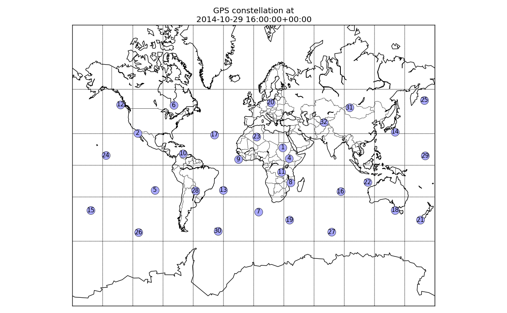

# Satellite KML generator

Plot satellite az/el, and make KML of satellites for visualization in Google Earth.


## Install

```sh
pip install -e .
```




## Examples

The first argument "TLE" can be a URL pointing to a TLE, a filename containing TLE, or the TLE itself. If you specify a URL, the program will download to the current directory and load it.

### time instant

```sh
python satplot.py gps-ops.txt 2015-05-12T16:00:00 -k out.kml -c 65 -148 0
```

### range of time

```sh
python satplot.py gps-ops.txt 2015-05-12T16:00:00 2015-05-12T17:00:00 -c 65 -148 0
```

The main data product of the program is a 3-D pandas Panel `data` with dimensions time x satnum x parameter

## Alternate, manual install (not needed for most users)

Most people do not need to do this:

```sh
apt install libgeos-dev libgeos++-dev
pip install basemap
```

## Notes

* [basemap examples](http://introtopython.org/visualization_earthquakes.html)
* [basemap API reference](http://matplotlib.org/basemap/)
